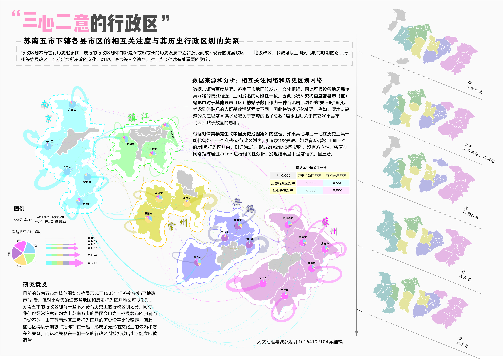

## About Me
I am pursuing a Master degree in Regional Planning in Cornell University. My research interests focused on urban economic development and public transportation. I am familiar with spatial analysis and data mining with proficiency in R, Python, ArcGIS Pro, and Stata. Also, I can use graphic design tools such as Illustrator and AutoCAD and CorelDraw.
 
I have rich practical experiences as an urban planner. I have been involved in 6 complete urban planning projects in China, ranging from planning for industrial parks in large cities to designing waterfront cultural landscapes in small towns. I used to make detailed market analyses for different industries, conduct case studies, and provide viable consulting solutions for local economic development. During these practical experiences, I often communicated with government officials and private sector clients. I was responsible for conducting interviews with rural residents in small villages and experts in the modern agriculture and logistic industry when I was an urban planner. In addition, due to my background in human geography, I am good at applying spatial analysis tools to solving problems, and always respect spatial differences and emphasize local cultures in my urban planning practice.

## Technical Skills
- Stata, Python, R, ArcGIS
- CorelDraw, Adobe Illustrator, Adobe InDesign, AutoCAD, Adobe Photoshop

## Research Interests

- **Urban Big Data Analytics** 
- **Public Transportation**
- **Urban Networks**
- **Built-environment**

## Work Experience

- **Mar. 2021 - Jun.2021** 
   
  **Urban Planner** at [[Shanghai One-tenth Art Company](https://www.onetenth.cn/en/home/)]
   
  Engaged in the Waterfront Area Planning Project in Longquan City as a core team member[[Project Info](https://www.onetenth.cn/en/cities/p_f992b662a4c3d36c3a92f7c7bd14cbd2)]. Discovered local cultural spaces, applied the cultural landscape theory and spatial analysis in the local culture revitalization, and carried out architecture programming of 10 future public waterfront venues.
- **Aug. 2020 - Mar.2021** 
   
  **Urban Planner** at [[Shanghai TIANHUA Urban Planning and Design Co., Ltd](https://www.thape.com/?locale=en)]
   
  Responsible for several urban planning projects:Chengdu Beihu Bamboo Industry Area Planning Project[[Project Info](https://www.thape.com/works/60)], Suzhou Lujia Subway Station TOD Project, Zhangzhou Longhai Fishery Port and Industry Area Planning Project, Hainan Lingao yacht port and yacht industry area Planning Project. Mapped regional competition patterns of industries, estimated amounts of future customer groups (e.g., tourists, residents) and the building area for residential or commercial uses, made real estate financial analysis; communicated plans with real estate developers and local government officials

## Research Experience

- **Effects of home and workplace built environments on park usage: A case study of Shanghai** 09/2019-06/2020 
   
  [Project Info](https://github.com/april29liang/Homepage/blob/main/assets/Encorage%20Trips%20to%20Green%20Spaces_Jiaqi%20Liang.pdf)]
   
  Geocoded addresses of each individual’s home and workplace and calculated their shortest distances; Collected and processed park usage frequency, social-economic data and health information. Quantified built environment factors (e.g., mixed land-use index, street cross density) based on POI (Point of Interest) data mining. Implemented a Gradient Boosting Decision Tree model to analyze the non-linear impact of urban built environment on park usage frequency

- **How the Location Selection of High-speed Railway Stations Influences Station Area Development in China?** 09/2017-09/2020
   
  [Project Info](assets/HSR and station area_Jiaqi Liang.pdf)]
   
  Established the group project as the leader; Archived and preprocessed social-economic, NPP-VIIRS nighttime light imagery, and POI data related to high-speed railway stations at both county and city levels; Used geocoding services to enrich heterogeneous raw data with their geographic information. Used focal statistics to measure station area development based on night activity; Implemented multivariate regression analysis and Difference-in-Difference estimation to determine the statistical importance of station construction based on panel data ranging from 2012 to 2016

- **Indonesia Case Study of the Development Research about Science, Technology and Innovation Parks in Asian-Pacific Countries** *sponsored by United Nations Economic and Social Commission for Asia and the Pacific* 09/2018-06/2019
   
  Conducted literature review and analyzed cases of Indonesia STI parks; Wrote a report about the history, type and operation of Indonesia STI parks; Discussed current studies of other Asian-Pacific countries

- **Mapping World Cruise Port Network** 12/2018-03/2019
   
    
  [Project Info]([assets/HSR and station area_Jiaqi Liang.pdf](https://github.com/april29liang/Homepage/blob/03a2881cb8ec6c11574e13e9cf6638c72e9142be/assets/Mapping%20Cruise%20Network_Jiaqi%20Liang.pdf))]
   
  Performed world cruise data scraping, including starting city, destination and itinerary information; Geocoded port addresses by using Google Map API. Calculated the in- and out-degree centrality of each port based on social network modeling, and analyzed the core-periphery structure of the network. Visualized geographic patterns of market share with respect to different cruise companies 

- **Do historic administrative divisions relate to mutual perceptions of residents from 21 southern Jiangsu counties today?** 12/2018-02/2019
   
  Retrieved mutual comments from threads on Baidu Tieba (one of the most popular internet forums in China) and historical records of administrative divisions according to Chinese historical maps. Implemented QAP correlation analysis on administrative division networks formed by spatial and semantic relations respectively. Visualized administrative divisions across time and mutual perceptions nowadays, along with narratives, statistical summaries and charts
   
  

## Honors and Prizes
- **Excellent Undergraduate Student of Shanghai** *awarded by Shanghai Municipal Education Commission* 06/2020
- **China National Scholarship** *awarded by Ministry of Education of the People’s Republic of China* 09/2018
